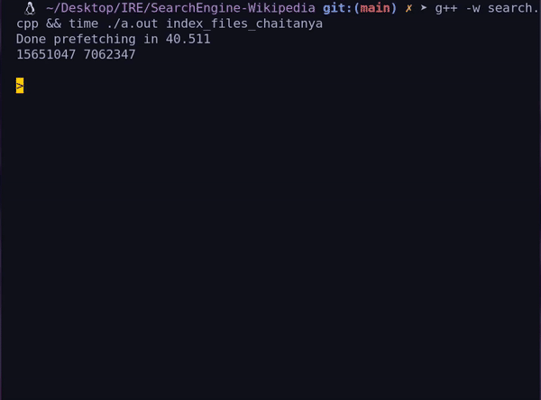

# Search-Engine-Wikipedia

This Repository consists of code for building a search engine from scratch. 

 

Wikipedia [Dump](https://dumps.wikimedia.org/enwiki/20210720/enwiki-20210720-pages-articles-multistream.xml.bz2)

Building a Search Engine consists of 2 phases
* Indexing Phase  
Inorder to build the Index run the command:
 <pre>
 python3 index.py <i>path_to_xml_dump</i> <i>path_to_index_dir</i> stats 
 </pre>
 
* Search Phase  
Inorder to perform Search run the command:
<pre>
g++ -w search.cpp && ./a.out <i>path_to_index_dir</i> 
</pre>

## Advanced Search

Wikipedia Article Consists of the following fields
* Title - `t`
* Body - `b`
* Category - `c`
* Infobox - `i`
* References - `r`
* External Links - `l`

#### Plain query

`rohit cricket ipl`

#### Field query

`rohit c: cricket b: ipl` - prioritizes documents with `cricket` in category and `ipl` in body.

---
C++ Stemmer used [Oleander Stemming Library](https://github.com/OleanderSoftware/OleanderStemmingLibrary)

C++ Thread Pool used [Thread Pool](https://github.com/progschj/ThreadPool)
